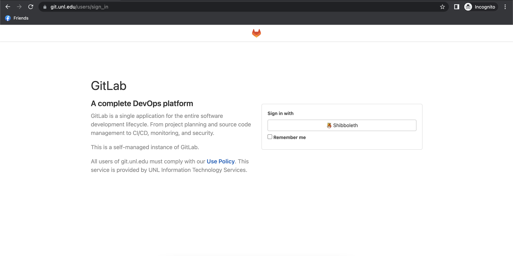
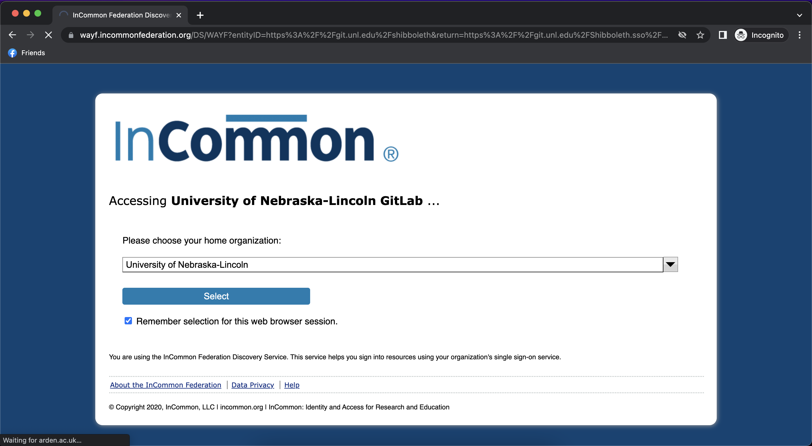
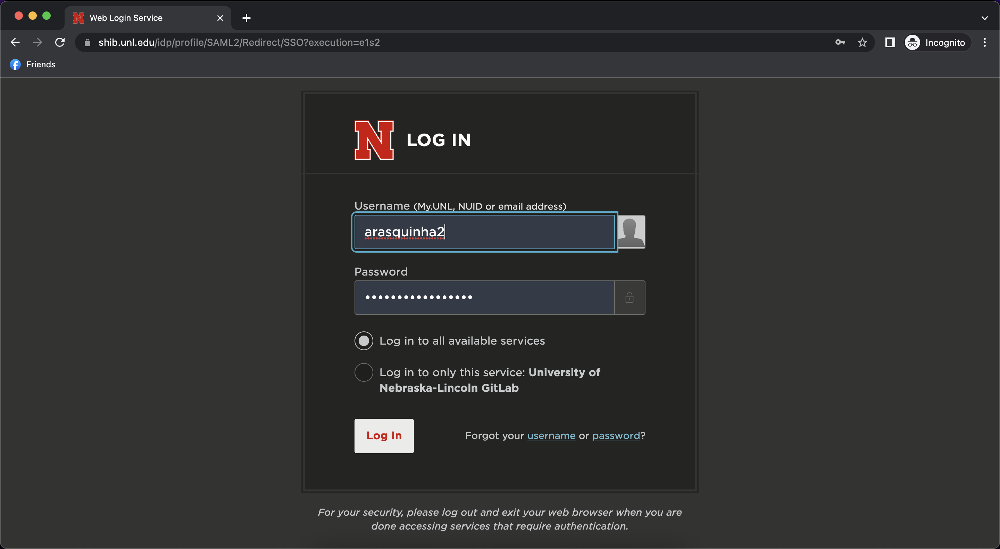
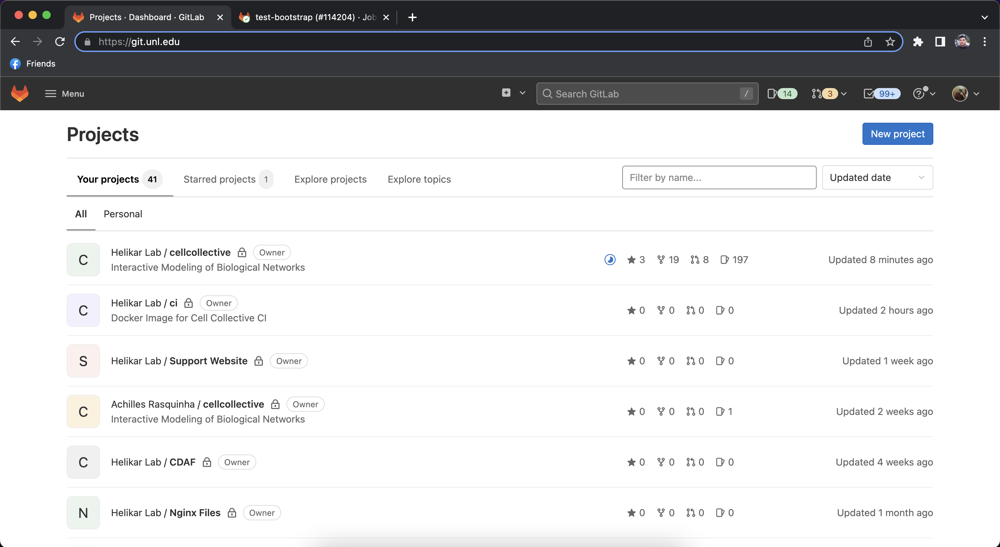

# Installation

## Table of Contents

* [Development](#development-installation)
* [Production](#production-installation)

### Development Installation

### Production Installation

* Go to https://git.unl.edu
* Sign in with Shibboleth

* Choose the "University of Nebraska-Lincoln" as your home organization.
You will then be redirected to UNL's login page.

* Login using your UNL credentials.

You should now be able to see GitLab's home page that contains all repositories associated to the HelikarLab group.
(**NOTE**: If you're unable to see this, kindly contact a Senior Developer/Project Manager to gain access).

